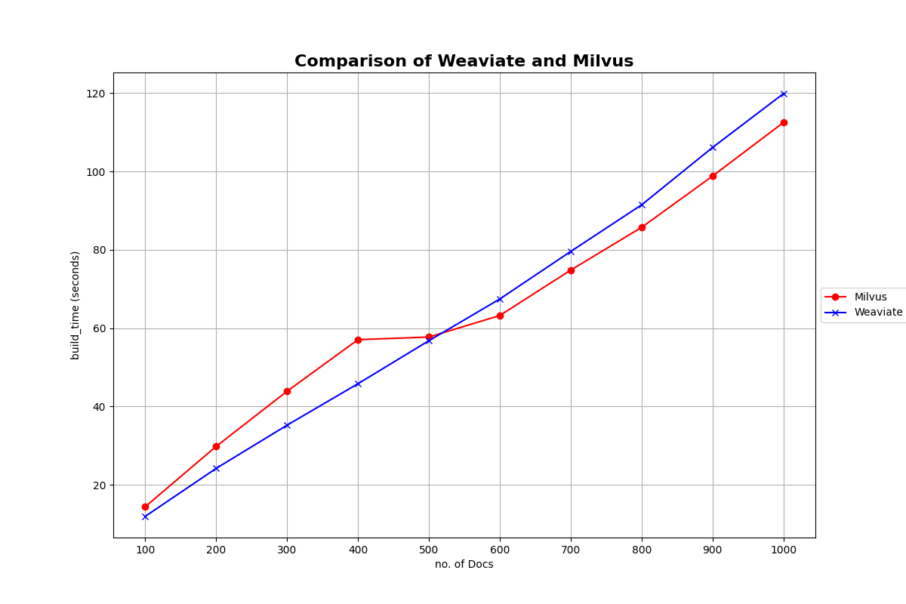
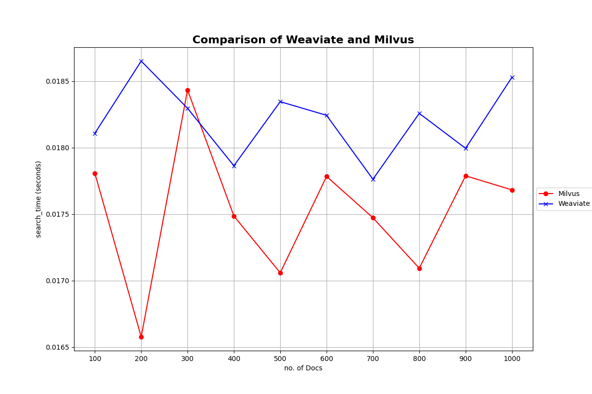

# weaviate-vs-milvus
Comparative analysis of Weaviate and Milvus vector databases using a dataset of over 1K resumes. Includes build time, search time, and throughput benchmarks with varying data and query loads.

## Getting Started
To replicate this analysis or to conduct your own, follow these steps:
1. Clone this repository.
2. Ensure you have Python installed, along with the libraries listed in `requirements.txt`.
4. Set up instances of Weaviate and Milvus using weaviate/run.sh and milvus/run.sh respectively.
5. Run the benchmarking scripts to perform the tests.

## Results
Build time comparison of weaviate and milvus

Search time comparison of weaviate and milvus

